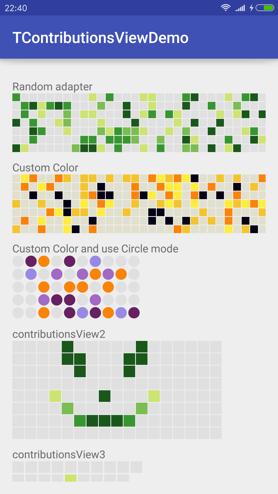
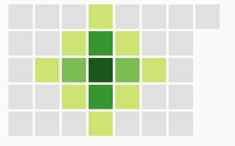
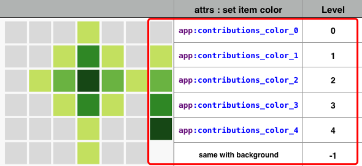
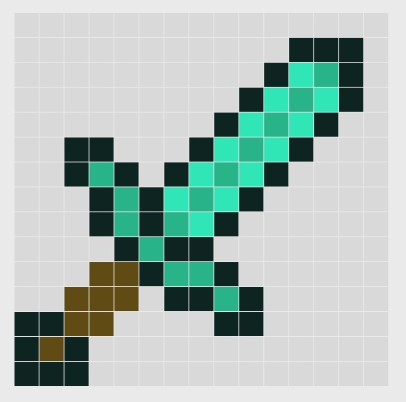
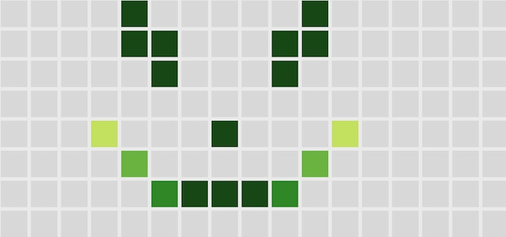
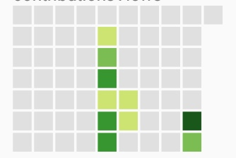

TContributionsView可以用以显示类似github贡献度的View，当然，也绝不仅限于此~

# 1. 效果图

使用：
```java
compile 'com.barryzhang:tcontributionsview:0.0.1'
```
目前处于测试状态，所以还需要：
```java
repositories {
    maven {
        url 'https://dl.bintray.com/barryhappy/maven/'
    }
```
# 2. 快速开始：

只需这么写：
```java
IntArraysContributionsViewAdapter adapter = new IntArraysContributionsViewAdapter();
Integer arrays[][] = {
        {0, 0, 0, 1, 0, 0, 0, 0},
        {0, 0, 1, 3, 1, 0, 0},
        {0, 1, 2, 4, 2, 1, 0},
        {0, 0, 1, 3, 1, 0, 0},
        {0, 0, 0, 1, 0, 0, 0},
};
adapter.setArrays(arrays);
contributionsView.setAdapter(adapter);
```

# 3. 属性&Level说明

目前支持0-5五个Level的格子、以及一个用-1表示的空状态。 
只需给不同的格子设置不同的Level，即可控制它的显示。

在xml中设置颜色、尺寸：
```xml
<com.barryzhang.tcontributionsview.TContributionsView
    android:id="@+id/contributionsView1s"
    android:layout_width="wrap_content"
    android:layout_height="wrap_content"
    app:contributions_color_0="#E1DFCE"
    app:contributions_color_1="#FFED3B"
    app:contributions_color_2="#F4C42E"
    app:contributions_color_3="#FB8308"
    app:contributions_color_4="#040015"
    app:contributions_item_height="10dp"
    app:contributions_item_space="1dp"
    app:contributions_item_width="10dp"/>
```
# 4. Adapter
使用setAdapter进行数据设置：
基本用法:
```java
BaseContributionsViewAdapter adapter;
// init adapter 
contributionsView.setAdapter(adapter);
```
已经内置了几种常用的Adapter，你也可以很方便地自定义自己的Adapter。 

* `PositionContributionsViewAdapter` ：基于(x,y)坐标
* `AbstractArraysContributionsViewAdapter`：使用一个二维数组进行标识，用起来特别方便
* `IntArraysContributionsViewAdapter`：继承AbstractArraysContributionsViewAdapter，使用int[][]表示数据
* `DateContributionsAdapter`：基于日期的表示，用这个Adapter可以很方便地实现类似github个人主页的贡献度图的效果
* `TestContributionAdapter`：一个随机的adapter~ 一般用以演示 :-D


## ArraysContributionsViewAdapter
前面的"快速开始"已经是一个例子，这个adapter其实还可以很方便地做一些其他的效果：
```java
IntArraysContributionsViewAdapter adapter = new IntArraysContributionsViewAdapter();
Integer arrays[][] = {
        {0, 0, 0, 0, 0, 0, 0, 0, 0, 0, 0, 0, 0, 0, 0,},
        {0, 0, 0, 0, 0, 0, 0, 0, 0, 0, 0, 4, 4, 4, 0,},
        {0, 0, 0, 0, 0, 0, 0, 0, 0, 0, 4, 2, 3, 4, 0,},
        {0, 0, 0, 0, 0, 0, 0, 0, 0, 4, 2, 3, 2, 4, 0,},
        {0, 0, 0, 0, 0, 0, 0, 0, 4, 2, 3, 2, 4, 0, 0,},
        {0, 0, 4, 4, 0, 0, 0, 4, 2, 3, 2, 4, 0, 0, 0,},
        {0, 0, 4, 3, 4, 0, 4, 2, 3, 2, 4, 0, 0, 0, 0,},
        {0, 0, 0, 4, 3, 4, 2, 3, 2, 4, 0, 0, 0, 0, 0,},
        {0, 0, 0, 4, 3, 4, 3, 2, 4, 0, 0, 0, 0, 0, 0,},
        {0, 0, 0, 0, 4, 3, 4, 4, 0, 0, 0, 0, 0, 0, 0,},
        {0, 0, 0, 1, 1, 4, 3, 3, 4, 0, 0, 0, 0, 0, 0,},
        {0, 0, 1, 1, 1, 0, 4, 4, 3, 4, 0, 0, 0, 0, 0,},
        {4, 4, 1, 1, 0, 0, 0, 0, 4, 4, 0, 0, 0, 0, 0,},
        {4, 1, 4, 0, 0, 0, 0, 0, 0, 0, 0, 0, 0, 0, 0,},
        {4, 4, 4, 0, 0, 0, 0, 0, 0, 0, 0, 0, 0, 0, 0,},
};
adapter.setArrays(arrays);
contributionsView.setAdapter(adapter);
```


恭喜你获得成就：『出击时间到！』 😁

通过`AbstractArraysContributionsViewAdapter`，可以使用任意数据类型T表示等级，只需要重写它的`int mapLevel(T from)`方法即可。

## PositionContributionsViewAdapter
基于(x,y)坐标，给每个格子设置显示等级
```java
PositionContributionsViewAdapter adapter =
        new PositionContributionsViewAdapter(8, 17);
adapter.put(0, 4, 4);
adapter.put(1, 4, 4);
adapter.put(1, 5, 4);
adapter.put(2, 5, 4);
adapter.put(0, 10, 4);
adapter.put(1, 10, 4);
adapter.put(1, 9, 4);
adapter.put(2, 9, 4);
adapter.put(4, 7, 4);
adapter.put(4, 3, 1);
adapter.put(5, 4, 2);
adapter.put(6, 5, 3);
adapter.put(6, 6, 4);
adapter.put(6, 7, 4);
adapter.put(6, 8, 4);
adapter.put(6, 9, 3);
adapter.put(5, 10, 2);
adapter.put(4, 11, 1);
contributionsView.setAdapter(adapter);
```



## DateContributionsAdapter
使用`DateContributionsAdapter`可以快速制作出类似github个人主页的贡献度显示效果。
这里的row被固定为7（一周）。
```java
DateContributionsAdapter adapter = new DateContributionsAdapter() ;
adapter.setWeekCount(10);
adapter.setEndDay("2016-11-20");
adapter.put("2016-10-17", 1);
adapter.put("2016-10-18", 2);
adapter.put("2016-10-19", 3);
adapter.put("2016-10-20", 4);
adapter.put("2016-10-21", 3);
adapter.put("2016-10-22", 3);
adapter.put("2016-10-27", 1);
adapter.put("2016-10-28", 1);
adapter.put("2016-10-20", 1);
adapter.put("2016-11-19", 2);
adapter.put("2016-11-18", 4);
contributionsView.setAdapter(adapter);
```


## 自定义

可以很方便地进行自定义Adapter，只需要继承BaseContributionsViewAdapter，然后重写其中几个方法即可。
```java
// 获取行数
public abstract int getRowCount();
// 获取列数
public abstract int getColumnCount();
// 获取指定行列所对应的level值（-1~4）
public abstract int getLevel(int row, int column);
```

内置的`TestContributionAdapter`是一个很简单的示例：
```java

public class TestContributionAdapter extends BaseContributionsViewAdapter {
    private int row;
    private int column;

    public TestContributionAdapter() { this(7,20); }

    public TestContributionAdapter(int row, int column) {
        super();
        this.row = row;
        this.column = column;
    }

    @Override
    public int getRowCount() { return this.row; }

    @Override
    public int getColumnCount() { return this.column; }

    @Override
    public int getLevel(int row, int column) {
        return (int) (Math.random() * 100) % 10;
    }
}
```
 


