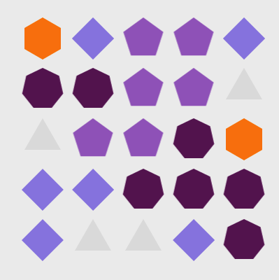

**[【中文说明点击这里】](./README.cn.md)**

`TContributionsView` can be use for a Contributions View, like in one personal homepage of Github, and more than that. 

> 👻At the beginning, I just want to use it for showing the contributions view like Github, and that's why it named `TContributionsView`. 
But later, I found it seems to be able to do more things than I want ……
For example: Github contributions, Pixel painting、Select seats in the cinema、checkerboard……

# 1. Overview



# 2. Quick Start

**Import：**
```java
compile 'com.barryzhang:tcontributionsview:0.2'
``` 
 
If you want to show this :  
  
Just writing these codes：

```java
IntArraysContributionsViewAdapter adapter = new IntArraysContributionsViewAdapter();
Integer arrays[][] = {
        {0, 0, 0, 1, 0, 0, 0, 0},
        {0, 0, 1, 3, 1, 0, 0},
        {0, 1, 2, 4, 2, 1, 0},
        {0, 0, 1, 3, 1, 0, 0},
        {0, 0, 0, 1, 0, 0, 0},
};
adapter.setArrays(arrays);
contributionsView.setAdapter(adapter);
```
😀Isn't very easy?

# 3. Attributes & `Level` 
  
Every rectangle item is mapping to a int value as its level. Now can use level 0 to 4 (like Github)，and a extra -1 to express empty status.
Just set different level to different item , you can control them. 

Set item color、size、if show circle in xml:  
```xml
<com.barryzhang.tcontributionsview.TContributionsView
    android:id="@+id/contributionsView1s"
    android:layout_width="wrap_content"
    android:layout_height="wrap_content"
    
    app:contributions_use_circle="true"
    app:contributions_color_0="#E1DFCE"
    app:contributions_color_1="#FFED3B"
    app:contributions_color_2="#F4C42E"
    app:contributions_color_3="#FB8308"
    app:contributions_color_4="#040015"
    app:contributions_item_height="10dp"
    app:contributions_item_space="1dp"
    app:contributions_item_width="10dp"/>
```

# 4. Adapter

Use setAdapter method to bind data to View.

**Base usage:**
```java
BaseContributionsViewAdapter adapter;
// config adapter 
contributionsView.setAdapter(adapter);
```
Several different Adapter were already built in project, and you can also build your custom Adapter very easily by yourself.

**Build-in Adapters:**

* `PositionContributionsViewAdapter` ：Based on (x,y) coordinate.
* `AbstractArraysContributionsViewAdapter`：Based on a two-dimensional array, this is intuitive and very very easy to use.
* `IntArraysContributionsViewAdapter`：This is extends AbstractArraysContributionsViewAdapter，use Int two-dimensional array.
* `DateContributionsAdapter`：Based on date, with this Adapter, you can easily to get a Contributions View like Github. 
* `TestContributionAdapter`：A random level Adapter —— I use it as a demo :-D


## 4.1 ArraysContributionsViewAdapter 

Mentioned earlier the "Quick Start" was a demo for ArraysContributionsViewAdapter, and in fact, it also can be used to do something much more interesting, like this: 
```java
IntArraysContributionsViewAdapter adapter = new IntArraysContributionsViewAdapter();
Integer arrays[][] = {
        {0, 0, 0, 0, 0, 0, 0, 0, 0, 0, 0, 0, 0, 0, 0,},
        {0, 0, 0, 0, 0, 0, 0, 0, 0, 0, 0, 4, 4, 4, 0,},
        {0, 0, 0, 0, 0, 0, 0, 0, 0, 0, 4, 2, 3, 4, 0,},
        {0, 0, 0, 0, 0, 0, 0, 0, 0, 4, 2, 3, 2, 4, 0,},
        {0, 0, 0, 0, 0, 0, 0, 0, 4, 2, 3, 2, 4, 0, 0,},
        {0, 0, 4, 4, 0, 0, 0, 4, 2, 3, 2, 4, 0, 0, 0,},
        {0, 0, 4, 3, 4, 0, 4, 2, 3, 2, 4, 0, 0, 0, 0,},
        {0, 0, 0, 4, 3, 4, 2, 3, 2, 4, 0, 0, 0, 0, 0,},
        {0, 0, 0, 4, 3, 4, 3, 2, 4, 0, 0, 0, 0, 0, 0,},
        {0, 0, 0, 0, 4, 3, 4, 4, 0, 0, 0, 0, 0, 0, 0,},
        {0, 0, 0, 1, 1, 4, 3, 3, 4, 0, 0, 0, 0, 0, 0,},
        {0, 0, 1, 1, 1, 0, 4, 4, 3, 4, 0, 0, 0, 0, 0,},
        {4, 4, 1, 1, 0, 0, 0, 0, 4, 4, 0, 0, 0, 0, 0,},
        {4, 1, 4, 0, 0, 0, 0, 0, 0, 0, 0, 0, 0, 0, 0,},
        {4, 4, 4, 0, 0, 0, 0, 0, 0, 0, 0, 0, 0, 0, 0,},
};
adapter.setArrays(arrays);
contributionsView.setAdapter(adapter);
```

  
Achievement get!  
『Time to Strike!』 😁  

And with `AbstractArraysContributionsViewAdapter`, you can use other data type T to express Level, just need to overwrite its `int mapLevel(T from)` method. 

## 4.2 PositionContributionsViewAdapter 

Based on (x,y) position, use it with giving to every item a level, default is level 0.
Here is a demo：

```java
PositionContributionsViewAdapter adapter =
        new PositionContributionsViewAdapter(8, 17);
adapter.put(0, 4, 4);
adapter.put(1, 4, 4);
adapter.put(1, 5, 4);
adapter.put(2, 5, 4);
adapter.put(0, 10, 4);
adapter.put(1, 10, 4);
adapter.put(1, 9, 4);
adapter.put(2, 9, 4);
adapter.put(4, 7, 4);
adapter.put(4, 3, 1);
adapter.put(5, 4, 2);
adapter.put(6, 5, 3);
adapter.put(6, 6, 4);
adapter.put(6, 7, 4);
adapter.put(6, 8, 4);
adapter.put(6, 9, 3);
adapter.put(5, 10, 2);
adapter.put(4, 11, 1);
contributionsView.setAdapter(adapter);
```



## 4.3 DateContributionsAdapter
Use `DateContributionsAdapter`, you can easily to get a Contributions View like Github.
Its row value is already be set to 7 (days of a week). 

```java
DateContributionsAdapter adapter = new DateContributionsAdapter() ;
adapter.setWeekCount(10);
adapter.setEndDay("2016-11-20");
adapter.put("2016-10-17", 1);
adapter.put("2016-10-18", 2);
adapter.put("2016-10-19", 3);
adapter.put("2016-10-20", 4);
adapter.put("2016-10-21", 3);
adapter.put("2016-10-22", 3);
adapter.put("2016-10-27", 1);
adapter.put("2016-10-28", 1);
adapter.put("2016-10-20", 1);
adapter.put("2016-11-19", 2);
adapter.put("2016-11-18", 4);
contributionsView.setAdapter(adapter);
```


## 4.4 Custom Adapter by yourself

You can custom an Adapter very easily by yourself, just need to extends `BaseContributionsViewAdapter`, and overwrite some methods. 
 
```java
// get row 
public abstract int getRowCount();
// get column 
public abstract int getColumnCount();
// get level（-1~4）
public abstract int getLevel(int row, int column);
```

The build-in `TestContributionAdapter` is a simple demo：

```java

public class TestContributionAdapter extends BaseContributionsViewAdapter {
    private int row;
    private int column;

    public TestContributionAdapter() { this(7,20); }

    public TestContributionAdapter(int row, int column) {
        super();
        this.row = row;
        this.column = column;
    }

    @Override
    public int getRowCount() { return this.row; }

    @Override
    public int getColumnCount() { return this.column; }

    @Override
    public int getLevel(int row, int column) {
        return (int) (Math.random() * 100) % 10;
    }
}
```

# 5. Custom Item Style（Canvas）
[Since version 0.2]  
You can get Canvas of view item, and so that you are able to custom any style as you want。
Demo：  
  

```java
TestContributionAdapter adapter = new TestContributionAdapter(5, 5);
adapter.setOnDrawItemListener(new TContributionsView.OnDrawItemListener() {
    // called before the default drawItem method
    @Override
    public boolean beforeDrawItem(RectF rect, Canvas canvas, Paint paintByLevel, int level) {
        // True will not called default drawItem method, false otherwise.
        return true;
    }
    //called after the default drawItem method
    @Override
    public void afterDrawItem(RectF rect, Canvas canvas, Paint paintByLevel, int level) {
        // Draw a Regular polygon inside the giving Rect area
        CanvasUtil.drawPolygon(rect,canvas,paintByLevel,level+3);
    }
});
contributionsView.setAdapter(adapter);
```

# 6. Change Log

## V 0.2
Add custom item style: `adapter.setOnDrawItemListener`

## V 0.1
Basic

# 7. About me
"barryhappy2010#gmail.com".replace("#","@") 

***
# 8. License 

    Copyright 2016 Barry Zhang

    Licensed under the Apache License, Version 2.0 (the "License");
    you may not use this file except in compliance with the License.
    You may obtain a copy of the License at

       http://www.apache.org/licenses/LICENSE-2.0

    Unless required by applicable law or agreed to in writing, software
    distributed under the License is distributed on an "AS IS" BASIS,
    WITHOUT WARRANTIES OR CONDITIONS OF ANY KIND, either express or implied.
    See the License for the specific language governing permissions and
    limitations under the License.


